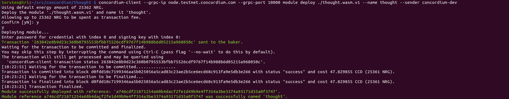
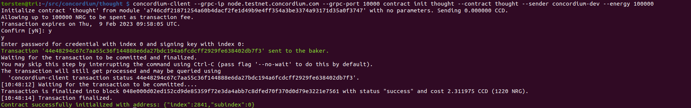
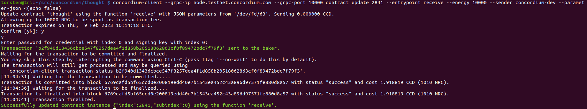
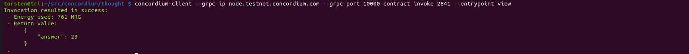

# Deploy Your First Smart Contract

## Smart contract deployment

Command 

    concordium-client --grpc-ip node.testnet.concordium.com --grpc-port 10000 module deploy ./thought.wasm.v1 --name thought --sender concordium-dev

Transaction Hash

    263842e8b9d23c360b0795553bfbb75526cdf9767f14b988b6d05215a968050c



## Smart contract init

Command 

    concordium-client --grpc-ip node.testnet.concordium.com --grpc-port 10000 contract init thought --contract thought --sender concordium-dev --energy 100000

Transaction Hash

    44e48294c67c7aa55c36f144888e6da27bdc194a6fcdcff2929fe638402db7f3



## Smart contract update 

Command

    concordium-client --grpc-ip node.testnet.concordium.com --grpc-port 10000 contract update 2841 --entrypoint receive --energy 10000 --sender concordium-dev --parameter-json <(echo false)

Transaction Hash

    b2f940d13436cbce547f8257dea4f1d858b20518062863cf0f89472bdc7f79f3



## Smart contract invoke

Command

    concordium-client --grpc-ip node.testnet.concordium.com --grpc-port 10000 contract invoke 2841 --entrypoint view



Invocation resulted in success:
 - Energy used: 761 NRG 
 - Return value:
```js
      {
          "answer": 23
      }
 .
```

