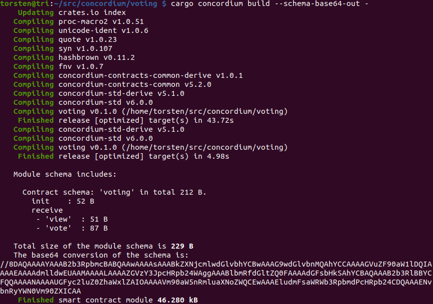
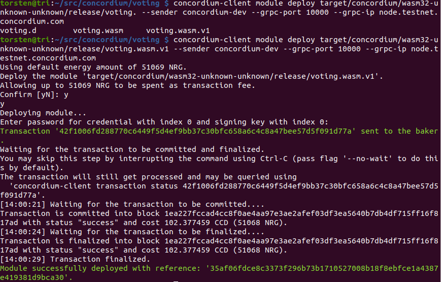

# Voting

Dapp to set up a new election, vote, display results, check ZK proofs and vote using ZK proofs

Based on talk by [Doris Benda](https://www.youtube.com/watch?v=J-SP_ptKu_I) and voting workshop .

## Deploy voting contract
    cargo concordium init
    cd voting/
    wget https://github.com/Concordium/voting-workshop/raw/main/smart-contract/src/lib.rs

    cargo concordium build --schema-base64-out -
    concordium-client module deploy target/concordium/wasm32-unknown-unknown/release/voting_contract.wasm.v1 --sender concordium-dev --grpc-port 10000 --grpc-ip node.testnet.concordium.com

    concordium-client module deploy target/concordium/wasm32-unknown-unknown/release/voting.wasm.v1 --sender concordium-dev --grpc-port 10000 --grpc-ip node.testnet.concordium.com

## Create Dapp

    mkdir dapp
    cd dapp/
    npm init
    npm install @concordium/web-sdk@3.1.0
    npm install @concordium/browser-wallet-api-helpers@2.0.0
    npm install live-server@1.2.2
    touch index.html
    npm start

